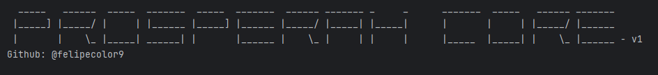
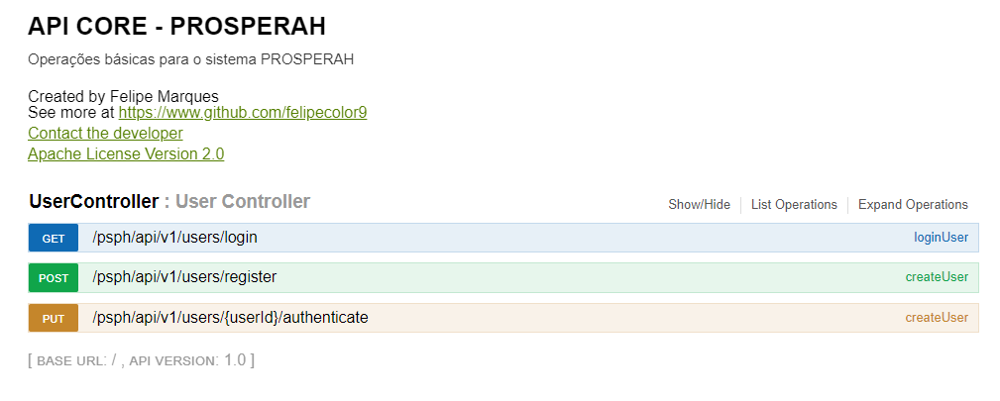
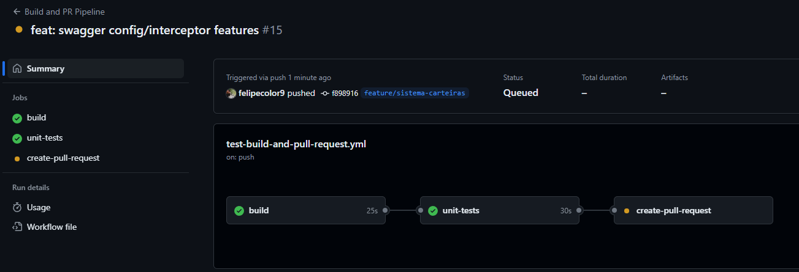
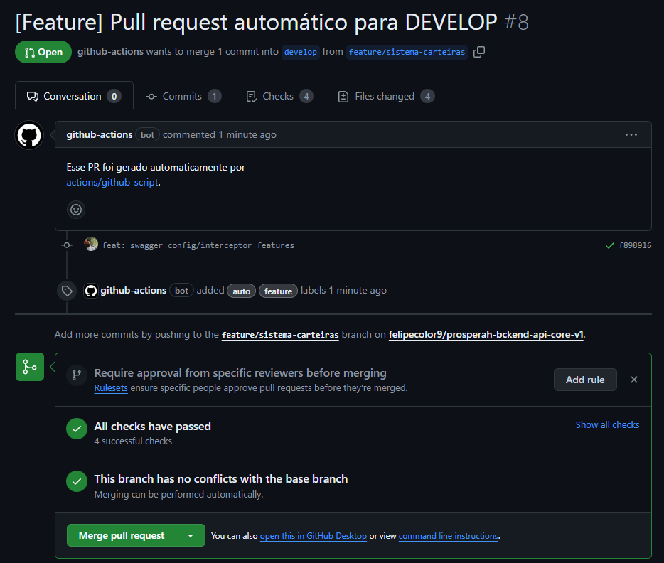
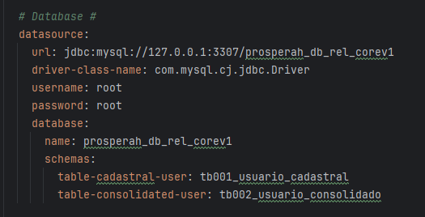
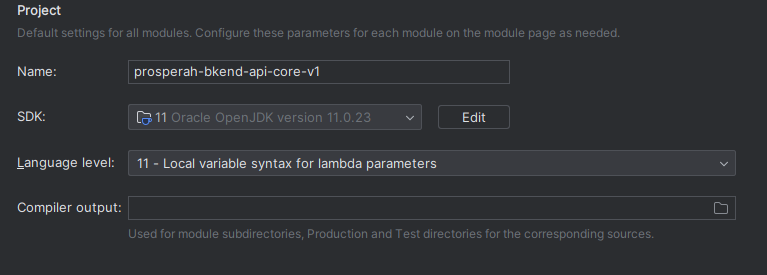
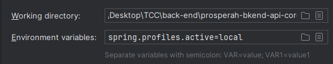

# prosperah-bkend-api-core-v1

API responsável pelo cadastro, autenticação, login e gestão de carteira/tópicos.

## Estrutura da aplicaçao

| Pasta           | Função                                                                                            |
|-----------------|---------------------------------------------------------------------------------------------------|
| Config          | Inicializa libs externas e outras configurações essenciais para o funcionamento do sistema        |
| Constants       | Contem valores constantes utilizados por todo a aplicação, em diversos contextos                  |
| Exceptions      | Exceptions de usuário personalizadas para as regras de negócio                                    |
| Handler         | Contem funções que capturam o fluxo ou a requisição e os automatizam, de acordo com a necessidade |
| Infraestructure | Contem o controller, serviços, repositorios e tecnologias externas                                |
| Utils           | Funções gerais úteis para o sistema                                                               |

## Swagger

`http://localhost:8080/swagger-ui.html#/`

## CI/CD

Automatizações na esteira que visam agilizar todo o processo de desenvolvimento
da aplicação e garantir um padrão minimo de confiabilidade e qualidade dos nossos
Pull Requests.

A action _'test-build-and-pull-request.yml'_ contido em _.github/workflows_
funciona de forma simples:

* Para cada push realizado nas branchs locais com o prefixo **'feature/'** essa action
  é executada.
* Ela **builda** e roda todos os **testes unitários** da aplicação
* Em caso de falha em alguns dos steps, o workflow é cancelado.
* Caso seja concluída, a action **cria um Pull Request automático** para a branch de desenvolvimento

Para mais detalhes, acessar
as [Actions](https://github.com/felipecolor9/prosperah-bckend-api-core-v1/actions/workflows/test-build-and-pull-request.yml)

## Testes locais

### 1. Configurar banco de dados locais
1. Baixar [MySQL Server/Workbench](https://dev.mysql.com/downloads/workbench/)
2. Instalar e configurar conexão com o Mysql em sua máquina
3. Executar o script da ultima versão do banco de dados, localizado na pasta local: `tcc_prosperah_db_mod_fisico-v2-script-5-25.sql`

### 2. Configurar Recursos externos
1. Nas propriedades de arquivo, acrescentar sua conexão recém criada com o banco de dados local
       
2. Configurar email e senha utilizado para enviar e-mails de autenticação

   #### É necessário gerar passe de acesso com o seu provedor de email para poder utilizar esse recurso

### 3. Configurar JAVA 
1. Na sua IDE, configurar a JDK responsável por executar sua aplicação (de preferencia a versão **Oracle OpenJDK 11**)

2. Configurar ambiente para local nas configurações de Run

